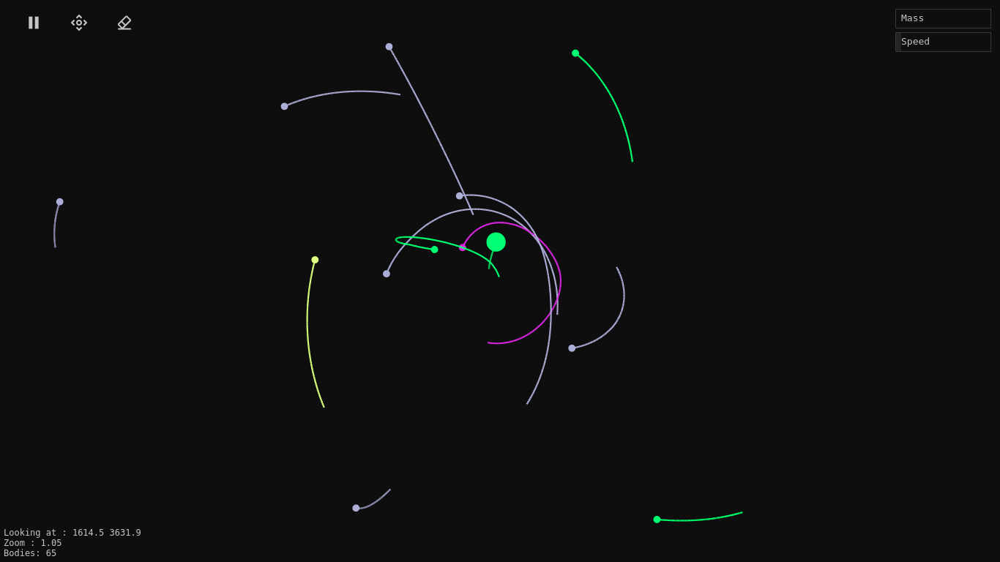

  

  <h3 align="center">Gravity Sandbox</h3>

  

    A simple, chaotic gravity simulator
     
     
    <a href="https://gravity-sandbox.netlify.app/">View Demo</a>
    ·
    <a href="https://github.com/siddharthroy12/gravity-sandbox/issues">Report Bug</a>
    ·
    <a href="https://github.com/siddharthroy12/gravity-sandbox/issues">Request Feature</a>
  

Gravity sandbox is a simple gravity simulator based on Newton's law of universal gravitation.

It's a web-based simulation so no need to install anything, just visit [the website](https://gravity-sandbox.netlify.app/) to play the game

## Controls

-  To play and pause
-  To Pan/Place Mode
-  To clear the canvas

# Todo

- Add follow the body feature
- Add saving and loading feature
- Add interesting simulations to load
- Add merge bodies on collition option
- Make this into a PWA
